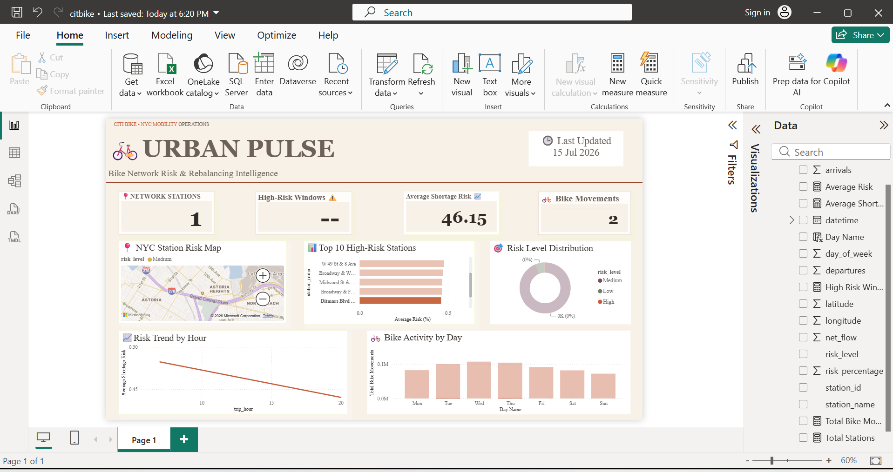

# 🚲 Urban Pulse – Citi Bike Rebalancing Predictor

Predicting bike-share station shortages before they happen using Python, SQL, and Power BI.

## 📌 Project Overview

Urban Pulse is a data analytics project that predicts bike shortages across Citi Bike stations and visualizes operational risk through an interactive Power BI dashboard.

The project combines Python for preprocessing and risk scoring, SQL concepts for analytical thinking, and Power BI for business intelligence reporting.

---

## 🎯 Objectives

- Analyze Citi Bike station activity
- Predict potential bike shortages
- Identify high-risk stations
- Support proactive bike rebalancing
- Build an executive dashboard for operational decision-making

---

## 🛠️ Tech Stack

- Python
- Pandas
- NumPy
- Power BI
- DAX
- Power Query
- SQL
- Git
- GitHub

---

## 📂 Dataset

- Citi Bike Trip Data (NYC)
- Cleaned and transformed using Python

---

## ⚙️ Workflow

Raw Data
      ↓
Python Cleaning
      ↓
Feature Engineering
      ↓
Risk Prediction
      ↓
Power BI Dashboard
      ↓
Business Insights

---

## 📊 Dashboard Preview

---

## 📈 Dashboard Features

- KPI Cards
- Station Risk Map
- Top 10 High-Risk Stations
- Risk Trend by Hour
- Bike Activity by Day
- Risk Distribution
- Interactive Filtering

---

## 🔍 Key Insights

- Wednesday records the highest bike activity.
- Midtown stations show elevated shortage risk.
- Average network risk score is approximately 43%.
- High-risk stations require proactive rebalancing.

---

## 🚀 Future Improvements

- Machine Learning prediction model
- Real-time data pipeline
- Live API integration
- Automated alerts
- Azure deployment

---

## 👤 Author

**Nilofer Syed**

LinkedIn: *(Add your LinkedIn URL)*

GitHub: https://github.com/nilofersyed
